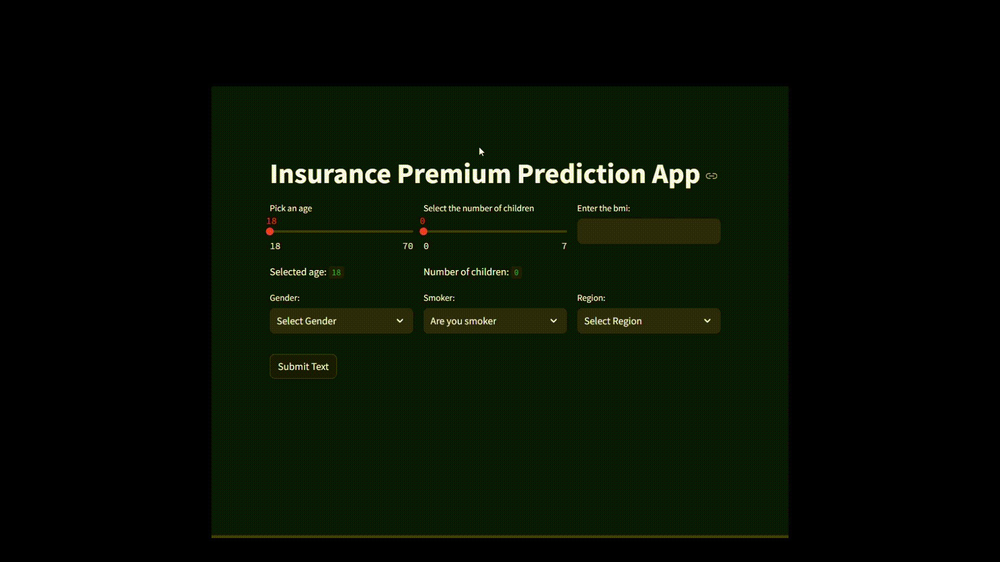
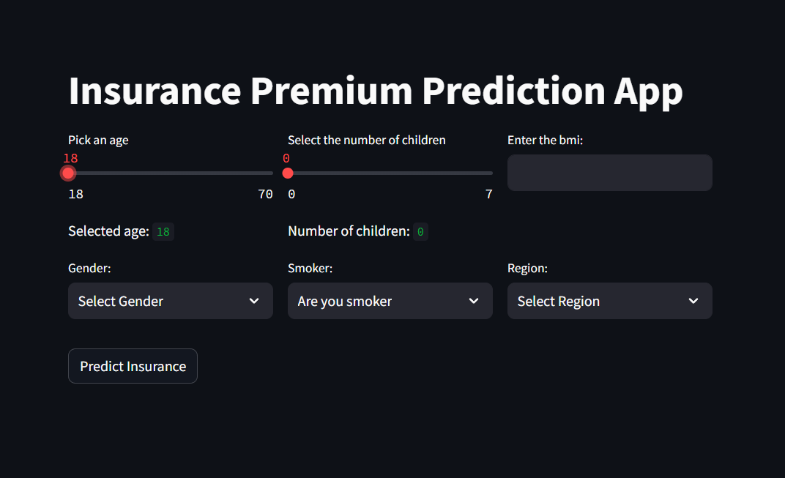
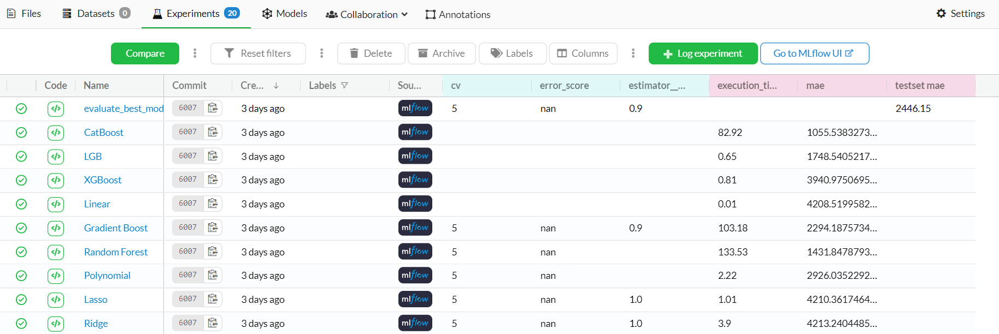

<!-- # Introduction
# Dataset
# Model Training
# Model Tracking
# Model Evaluation
# Model deployment -->

# Insurance Premium Prediction Application

## Overview<hr>

This is a machine learning application designed for predicting insurance premiums. The project leverages a variety of tools and frameworks to streamline data management, experiment tracking, and model deployment.

<!-- ## Demo
<hr>

 -->


## 🛠️ Tools Utilized
<hr>

- **DVC (Data Version Control)**: Used for managing and versioning data pipeline.
- **Git**: Version control system for tracking code changes.
- **MLflow**: Used for tracking the model training and model evaluation.
- **GitHub Actions Server**: Used for continuous integration and deployment.
- **Dagshub**: Facilitates MLflow experiment tracking and DVC data pipeline.

## 🛢️ Machine Learning Pipeline
<hr>

### Data Ingestion 📥

The application ingests insurance premium data from the _data/insurance.csv_ data path and saves it into `artifacts/DataIngestionArtifacts`.

### Data Transformation 🔧

Data undergoes transformation to prepare it for model training. Transformed data and preprocessing artifacts are saved into `artifacts/DataTransformationArtifacts`. Preprocessors are also stored in `models/`.

### Model Training 🤖

Multiple machine learning models are trained:
Linear Regression, Ridge Regression, Lasso Regression, Polynomial Regression, Random Forest,
Gradient Boosting, XGBoost, LightGBM, Catboost.
The top 4 performing models based on training metrics are selected. Both models and associated metrics are saved into `artifacts/ModelTrainerArtifacts`. __MLflow__ is used to track model parameters and metrics throughout this process.

### Model Evaluation 📊

The best-performing model on test data is selected and saved into `artifacts/ModelEvaluationArtifacts` and `models/`. Model evaluation metrics are tracked using MLflow.

### Streamlit App Development 💻

A Streamlit application is developed to allow users to input data and receive predictions from the trained model.



### Model Deployment 🚀

The model is deployend on the __AWS EC2__ using __Docker__ and __Github Action Server__.

## 📋 Model tracking with MLFlow
<hr>



## 🖇️ Data pipeline tracking with DVC
<hr> 


## 📁 Directory Structure
<hr>

```bash
📂.github/
└── 📂workflows/
      └── main.yaml
📂docs/
├── 📂docs/
│     ├── index.md
│     └── getting-started.md
├── mkdocs.yml
└── README.md
📂src/
├── init.py
├── 📂components/
│     ├── init.py
│     ├── data_ingestion.py
│     ├── data_transformation.py
│     ├── model_trainer.py
│     └── model_evaluation.py
├── 📂constants/
│     └── init.py
├── 📂entity/
│     ├── init.py
│     ├── config_entity.py
│     └── artifact_entity.py
├── 📂pipeline/
│     ├── init.py
│     ├── training_pipeline.py
│     └── prediction_pipeline.py
├── 📂utils/
│     ├── init.py
│     └── utils.py
├── 📂logger/
│     └── init.py
└── 📂exception/
      └── init.py
📂data/
  └── insurance.csv
📂experiment/
  └── experiments.ipynb
requirements.txt
requirements_app.txt
setup.py
app.py
main.py
README.md
implement.md
.gitignore
template.py
prediction.py
init_setup.ps1
dvc.yaml
Dockerfile
demo.py
config.json
.dockerignore
.dvcignore
```

## 📈 Models 
<hr>

- Linear Regression 
- Ridge Regression 
- Lasso Regression 
- Polynomial Regression 
- Random Forest
- Gradient Boosting
- XGBoost 
- LightGBM 
- Catboost


## 🖥️ Installation
<hr>

### 🛠️ Requirements: 

- Python 3.10
- mkdocs
- dvc
- numpy 
- pandas
- colorama
- mlflow==2.2.2
- dagshub
- scikit-learn
- xgboost
- lightgbm
- catboost
- streamlit


## ⚙️ Setup
<hr>
To reproduce the model and run the application:

1. Clone the repository:
    
    `git clone <repository_url>`<br>
    `cd <repository_name>`
    
2. Set up the virtual environment and install the requirements:

    `./init_setup.ps1`<br>

3. Execute the whole pipeline:

    `python main.py`<br>
    Now run the streamlit app.


## 🎯 Inference demo
<hr>

1. Run the Streamlit app:

    `streamlit run app.py`
2. Enter the input values and get prediction

## Contributors 👨🏼‍💻
<hr>
- Ravi Kumar